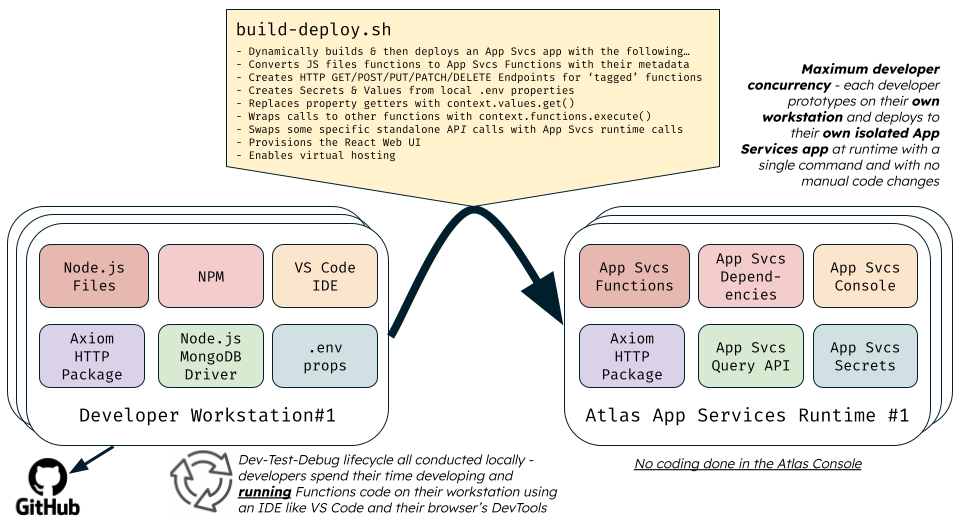

# Atlas App Services - Template Application Project

This project aims to show you how you can prototype and debug both the front-end and back-end components of your 'full-stack' [Atlas App Services](https://www.mongodb.com/docs/atlas/app-services/) application without having to develop code using the App Services Console. Additionally, you don't have to rebuild and re-deploy the application to the App Services runtime each time you need to test a change you've made. Instead, you can use your favourite local workstation tools, such as [Node.js](https://nodejs.org/), [VS Code](https://code.visualstudio.com/), and [Chrome DevTools](https://developer.chrome.com/docs/devtools/) for development and testing of code.

TODO: Embed YouTube quick demo video.

This approach not only allows developers to be shielded from each other when developing and testing the application's code on their workstations, but it also means that each developer's deployed App Services application is independent of any version of the application deployed by another developer. Even when there are multiple developers, they don't clash with each other when they are all concurrently working on the same project codebase.

You can use this 'skeleton' project as the basis of a new [Atlas App Services](https://www.mongodb.com/docs/atlas/app-services/apps/create/) project. The project has the following features:

- Sample [Atlas](https://www.mongodb.com/atlas) [MongoDB](https://www.mongodb.com/docs/manual/) database (in this case, with an example `persons` collection).
- An [App Services](https://www.mongodb.com/docs/atlas/app-services/) based 'back-end' containing Functions, Triggers and HTTPS Endpoints, where prototype, debug and test the code locally on your workstation.
- A [React.js](https://reactjs.org/) based 'front-end' containing a browser client-side rendered user interface using HTML/CSS/PNG/JavaScript, where prototype, debug and test the code locally on your workstation.
- A simple Bash script (`build-deploy.sh`) that automates the deployment of the full-stack application to the App Services runtime when you issue the single deploy command.
- Automated transfer of the sensitive properties that the project's `.env` file contains for use when running the project's code on your workstation to [Values and Secrets](https://www.mongodb.com/docs/atlas/app-services/values-and-secrets/) in the App Services runtime deployment.
- An example scheduled trigger (logs host runtime info) and an example database trigger (logs database event metadata) plus a set of example HTTPS Endpoints.

The project contains some minimal example components to constitute a complete working app. However, it is simple for you to rapidly remove or refactor the example parts and use the remaining skeleton project structure as the basis of your own Atlas App Services app. The example components in the project are composed of:

- One sample public function for a client to obtain the runtime's IP address.
- Two HTTPS Endpoints, one for persisting data about a person and one for returning this info.
- One scheduled trigger to periodically log the runtime's IP address.
- One database trigger to log a summary of changes made for each person in the database.


## Prerequisites

1. Ensure you have the following software installed on your workstation:

    - [Node.js JavaScript runtime](https://nodejs.dev/en/download/package-manager/)
    - [`npm` package manager CLI](https://docs.npmjs.com/downloading-and-installing-node-js-and-npm)
    - [MongoDB App Services `realm-cli` CLI](https://www.mongodb.com/docs/atlas/app-services/cli/)
    - [`jq` JSON CLI](https://stedolan.github.io/jq/)

2. Ensure you have a running [Atlas](https://www.mongodb.com/atlas) MongoDB dedicated (not serverless) cluster of any size/tier *you can use an 'M0' free-tier version). Using the Atlas console, ensure the cluster has a database user possessing just the **`readWrite` Specific Privileges for the `mytestdb` database** and ensure the Atlas Project's network access includes an **access list entry to allow access from your workstation's public IP address**.

3. For your Atlas project, which contains the Atlas database cluster to be used by the app, using the Atlas console, **create a Project API Key** for the project with just the `Project Owner` role enabled (be sure to save a copy of the generated private key as the console will only show this once). Ensure the **access list** for this Project API Key has your **current workstation's public IP address** listed.

4. From the Atlas console, navigate to your project, open `Project Settings`, and note its `Project ID`.

5. In a terminal on your workstation, from the root folder of this project, run the following command to copy an example environment configuration file to a new file into the same root folder called `.env`, and then edit the values for the properties shown in this new `.env` file to reflect your specific environment settings:

    ```console
    cp 'EXAMPLE.env' '.env'
    ```


## Deploy / Redeploy To Atlas App Services Runtime

In a terminal on your workstation, from the root folder of this project, execute the following command, which will rebuild the app from its source files and deploy the app to Atlas using the Atlas App Service's command-line tool (`realm-cli`):

```console
./build-deploy.sh
```

To access the app's user interface via a web browser, use the URL printed towards the end of the output from this executed script.

Note, the deployment process makes use of code in the `deploy-tools` folder to 1) create and populate a simple `persons` database collection and 2) convert all the 'standard' Node.js Javascript functions to App Services 'special' JavaScript functions and generate required Triggers and HTTPS Endpoints in the App Services runtime.


## Prototyping And Debugging Locally On Your Workstation

Both the back-end and front-end components can each be developed and tested locally. Because the front-end will invariably need to invoke services contained in the back-end, you should first deploy the application to the App Service runtime, when starting, before prototyping the front-end locally (this also enables the front-end component to know what the 'AppID' is of the App Services deployed app). The diagram below highlights how code execution is supported both on the local workstation adn the remote App Services runtime and the role of the `build-deploy.sh` script to convert from one to another:



The project code makes extensive use of 'modern' JavaScript (i.e. leveraging ECMAScript 2018+ / ES9+ standards).


### Front-end Code Development

Using Node.js (and NPM) installed on your workstation, you can run the front-end part of the app in 'development mode' and view and debug its user interface in a browser. Most types of changes you make to the React-based source files will immediately render in the browser without needing to issue a 're-deploy' command. To launch the app front-end in 'development mode', execute the following commands:

```console
cd front-end
npm start
```

You can then view the current user interface as it changes in a browser via [http://localhost:3000](http://localhost:3000). You can also debug the client-side code from the browser's 'Developer Tools' (keyboard shortcut: `Ctrl-Shift-i`).


#### Optionally Replace The Front-End With Your Own

The sample front-end application is just the default 'bare-bones' React application, which you would create with the `npx create-react-app` command, but with three modifications:

1. Dependency Atlas App Services package (`realm-web`) added
2. Dependency HTTP package (`axios`) added
3. File `front-end/src/App.js` modified in the following ways, based on the guidance outlined in the Atlas App Services [Quick Start with React - Web SDK](https://www.mongodb.com/docs/realm/web/react-web-quickstart/) documentation:
    - Authenticate anonymously to the deployed App Services app.
    - Invoke the App Services app's remote `PUB_getHostEnv` to obtain and show the host IP address of the app services runtime, which processed the request.
    - Make a REST GET HTTP call to the App Services app's `/personInfo` HTTPS Endpoint to obtain and show the name and date of birth from the first person (`id=1`) in the database.

For reference, the following commands were originally run to create the front-end component: 

```
npx create-react-app front-end
cd front-end
npm install --save realm-web axios
// Then edited the file front-end/src/App.js
```

Therefore, if you don't want to add to what already exists, you can completely delete the `front-end` folder and create your React-based application inside a new replacement `front-end` folder using the `npx create-react-app` and any other improvements you desire. 


### Back-end Code Development

Using Node.js installed on your workstation or your IDE (e.g. _VS Code_), you locally code, refactor and debug the JavaScript functions in the source files in the `back-end/src` folder. The top of the `back-end/src/main.js` source file (and `back-end/src/app-svcs-lifecycle.js`) contains sample code to run the functions that you will subsequently deploy as an Atlas App Services app. To test one of the functions, uncomment the line which invokes the function you want to debug before executing the Node.js file from your IDE or command line. Example Node.js command line to execute:

```console
node back-end/src/main.js
```

*IMPORTANT*: Before the code can successfully connect to the Atlas-based MongoDB database from Node.js on your workstation, you will need to ensure the Access List of the Atlas Org API Key and Project API key you created earlier contain the public IP address of your workstation.

When you execute one of the functions in the `main.js` file (or `app-svcs-lifecycle.js` file), in addition to logging the results to the console, it writes its result to the file `tmp/results.json`. This file output is helpful when viewing a function that returns a large response. See the next section for details on the code conventions you should employ in the back-end component, to enable it to be converted to an App Services app.

For database persistence, when executing 'in development' from the workstation, the code uses the [MongoDB Node.js Driver](https://www.mongodb.com/docs/drivers/node/current/) to interact with an Atlas database. When deployed to the App Services runtime, the code uses [App Serivces's built-in data source client](https://www.mongodb.com/docs/atlas/app-services/functions/mongodb/). The code required for each environment is identical for most CRUD operations. Where this isn't the case, code logic determines which type of persistence code to execute (see the next section of this README).

For invoking remote HTTP services, the project uses the same [Axios NPM package](https://www.npmjs.com/package/axios) library when running locally on a workstation and remotely in the App Services runtime.


#### Code Structure Conventions To Enable Conversion To App Services App

The `build-deploy.sh` script uses the utility code at `deploy-tools/src/convert-to-app-svcs-proj.js` to convert JavaScript functions contained in `.js` files into App Services Functions definitions. It generates the [App Configuration](https://www.mongodb.com/docs/atlas/app-services/reference/config/) required for App Services deployment.

This process first incorporates the contents of a skeleton App Configuration structure contained in the `template`. Therefore, to include other App Services resources in the final deployed project, you can add these to the `template` folder if you follow the [App Configuration](https://www.mongodb.com/docs/atlas/app-services/reference/config/) rules. 

You can create as many JavaScript `.js` files as you desire inside the `back-end/src` folder. The code conversion process uses the following rules to pick up appropriate functions defined in your varuous `.js` files and convert them to App Services Functions:

- Functions with names prefixed with **`PRIV_`** are included with their permissions set to **private** and authentication set to **system**.
- Functions with names prefixed with **`PUB_`** are included with their permissions set to **public** (can be invoked remotely) and authentication set to **system**.
- Functions with names prefixed with **`GET_`**, **`POST_`**, **`PUT_`**, **`DELETE_`**, **`PATCH_`** are included with their permissions set to **private** and authentication set to **system**. An HTTP Endpoint is also generated with its HTTP Method set to the respective REST API Verb implied by the prefix.
- Functions without the above prefixes are not included in the App Services deployed app.

Within your JavaScript code, you can add one of the following new lines above an existing line in the source code if you want the existing line to be commented-out/uncommented/removed during the code conversion process:

- `ACTION: COMMENT`
- `ACTION: UNCOMMENT`
- `ACTION: REMOVE`

This capability is helpful if you know you have some code that will only work locally in Node.js or will only work remotely in the App Services runtime. Alternatively, you can use the `AppSvsUtil.isRunningInAppSvcs()` function (from `back-end/src/app-svcs-util.js`) to dictate a specific code path to execute at runtime.

The code conversion process replaces every place in the code that uses `context_values_get()` to use the App Services library function `context.values.get()` instead, which will then get values from App Services configured Secrets.

The code conversion process wraps calls from one function to another inside `context.functions.execute()` to enable the function invocation to work correctly when running in App Services.

The conversion process replaces some tokens with deployment environment values in various App Services JSON config files, including the App Name, Deployment Region/Location, Database Cluster Name and Database Name.

Unrelated to the conversion process, a key convention used in the back-end code is using [JavaScript classes](https://developer.mozilla.org/en-US/docs/Web/JavaScript/Reference/Classes). This approach enables you to group related functions/methods without requiring them to be subsequently unpacked into separate App Services Functions during deployment (e.g. `class PersonsManager`). To allow access to class instances, a 'wrapper' function is required (e.g. `function PRIV_getPersonsManager()`). For an example of this in action, see `back-end/src/persons-manager.js`.  

The code uses the convention of providing a constants accessor function to enable it to share constants between different App Services Functions. For example, see `function PRIV_getConstants()` in `back-end/src/constants.js`. Each time you want to reference a constant from another function, you employ code similar to the following: `const myXyz = PRIV_getConstants().XYZ; `.


#### Restrictions / Caveats

Due to limitations in the way the code conversion process works, there are restrictions to the way you construct your back-end code, including:

- Your definition of the signature of a function you need to convert must be wholly declared in a single line of code and not over multiple lines. The declaration must include the `function` keyword. You cannot use the arrow function to define these 'convertible' functions, although you can use arrow functions inside the code of these 'normal' functions. The single line definition needs to encompass the function's name, the optional `async` prefix if required, and its parameters contained in brackets).
- For any given line of code, you must only invoke one `PRIV_` prefixed function in that line of code. If you attempt to invoke two `PRIV_` prefixed functions from the same line of code, the generated App Services Function will contain syntax errors. 
